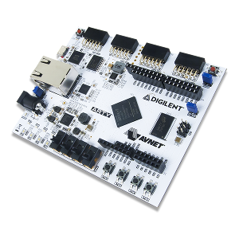

# Welcome to Arty CM0 DesignStart project

_Under construction_

This github repository provides the necessary files to use the
DesignStart Cortex-M0 system on a Digilent ARTY FPGA board.



**This project does not include the source code of the DesignStart
  Cortex-M0. You have to request it directly from ARM.**

In addition to allow synthesis of the designstart to a Xilinx target,
this project allows also simulations using the simulation tools :

  - Icarus iverilog
  - Xilinx simulation tools (xvlog/xelab/xsim)
  - Verilator


## Project layout

    common        # shared files for configuring the projects
    ips           # Modules created using Xilinx Vivado
    rtl           # Verilog RTL files for the project
    sim           # Verilog simulation directory
    synt          # synthesis directory
    verilator_sim # Verilator build/simulation directory
    software      # Local testsuites (asm/c programs)
    import        # imported github submodules (currently only amba_components)
    docs          # the mkdocs/markdown sources for this site
    site          # generated html/js files for this site


## Installation

### Cloning from github

This project uses submodules. To clone it you need to run the following commands :

```bash
 git clone git@github.com:rbarzic/arty-cm0-designstart.git
 cd arty-cm0-designstart
 git submodule init
 git submodule update
```

### Setting environment variables


The ARM Cortex-MO designstart package is not included in this project. You must download it yourself and setup the `DESIGNSTART_TOP` variable to point to the directory it had be installed in :

    export DESIGNSTART_TOP=<Path to Cortex-M0 designstart top folder>


### Patching Cortex-M0 designstart folder

The code provided by ARM needs to be modified. The changes are gathered in a patch file.

    make -C patches patch


## Compiling test programs

Test programs are located under the software directory.

To compile, enter the directory of the program and type :
`make all`

Several files (bin, hex, vmem and vmem32,..) should be created

## Simulation  using Icarus iverilog

Go into a test program directory (under software/xxx) then :

```bash
# Compile C code
make all
# build iverilog simulator files
make comp
# run the simulation
make run

# optionaly, you can look at waveform using gtkwave
make wave
```

Simulation should stop when _main()_ exits or _exit()_ is called directly

## Synthesis using Vivado

The complete flow is shown in the following figure :


The first part of the flow is the generation of the first bit file.
Verilog files are parsed by Vivado together with constraint files and
a file to initialize the program memory.

Later, the Vivado utility _updatemem_ is used to change the content of
the program memory without the need for a new synthesys

Files used by the synthesis flow :

    vivado_utils.tcl        # Various _tcl_ functions
    vivado.tcl              # The main synthesis script
    report_bram.tcl         # tcl code to output block ram placement (for _updatemem_)
    xilinx_constraints.xdc  # Constraint file (clock, pads,..)
    code.vmem32             # the original content of the program memory

### Running the synthesis

```bash
make synt
```
Files generated by the  synthesis flow :

    rpt/cpu.bit        # Xilinx bitstream file
    chip_layout.v      # Post Place&Route Verilog netlist
    chip_layout.sdf    # Post Place&Route timing backannotation file (SDF)
    bram.yaml          # Block RAM placement file


### Programming the device


### Updating the program memory

To create a new bit file without launching a new synthesis :
```bash

make update TEST=<test name>
```
where <test name> is the name of a test under _software_


## Simulation  using Vivado

### RTL simulation

### Post Place&Route backannotated simulation

## Simulation  using Verilator
